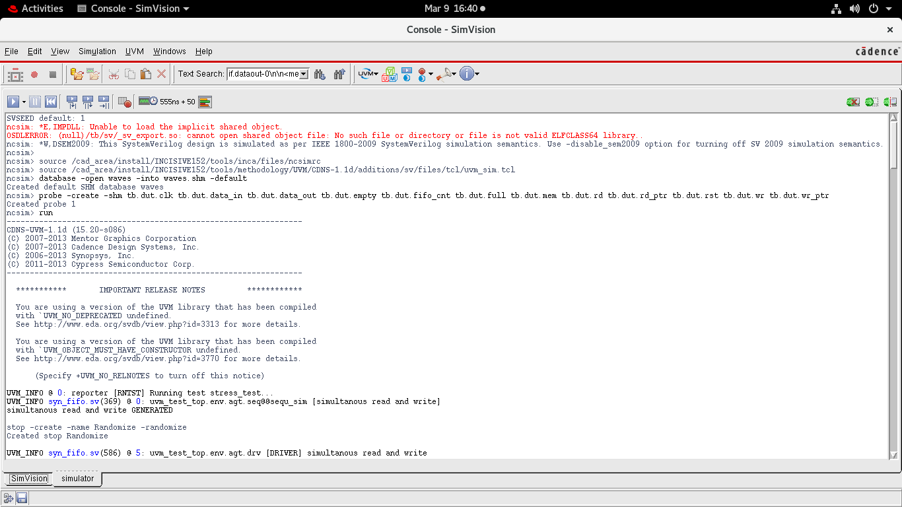
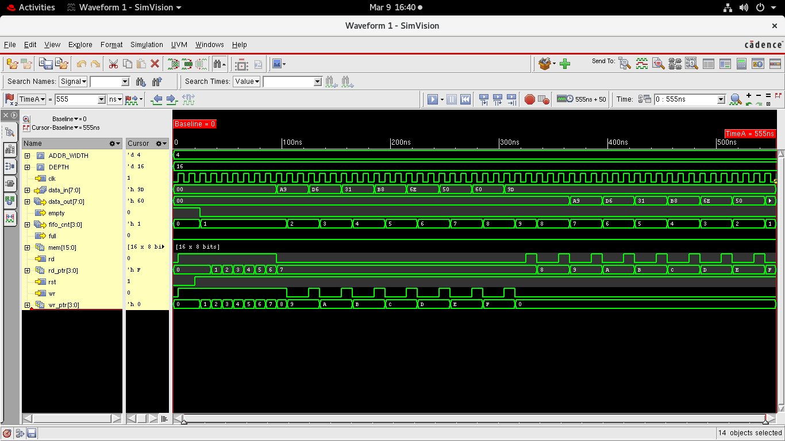
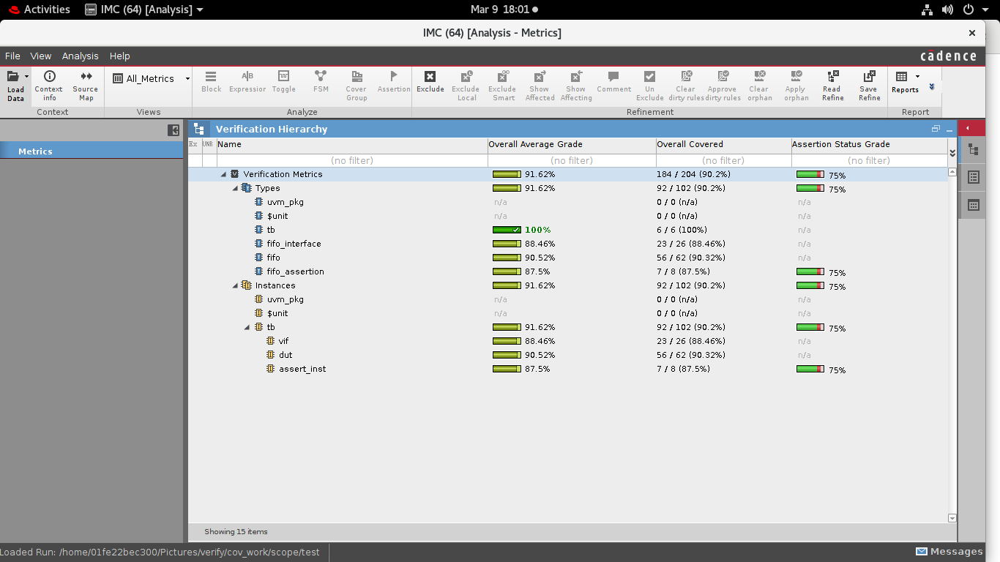
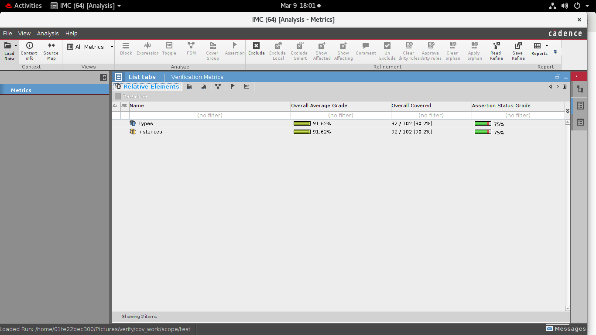
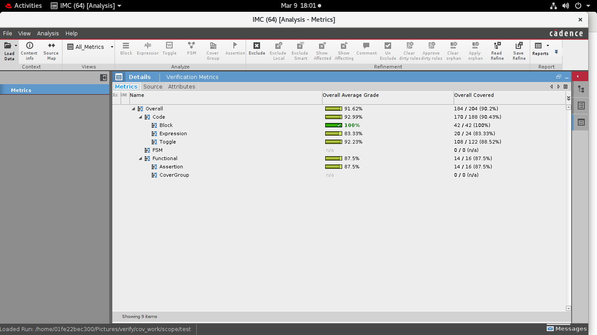
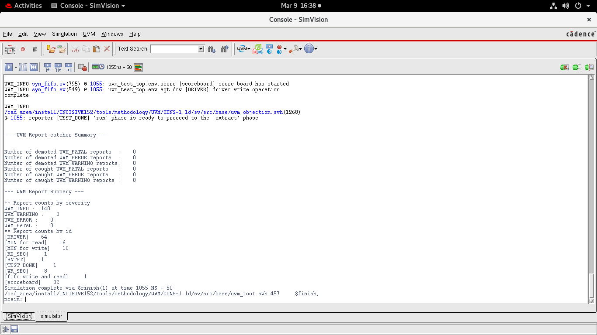
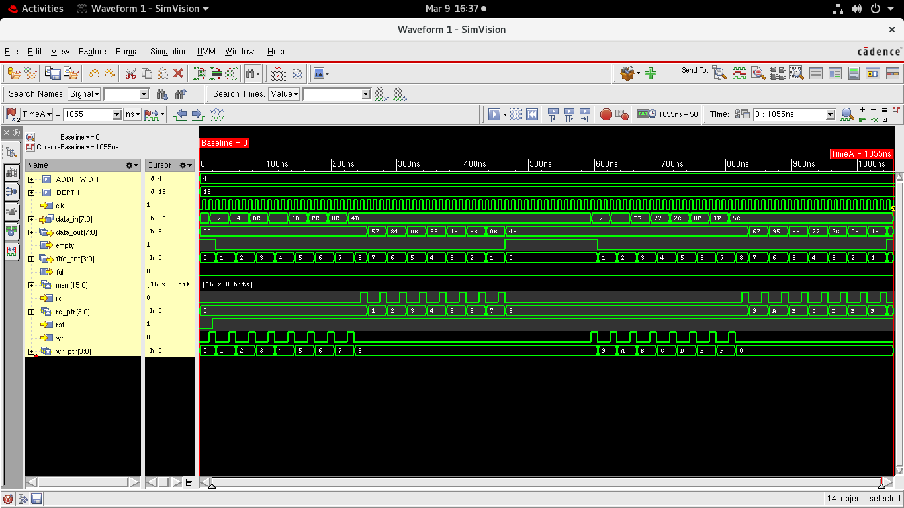
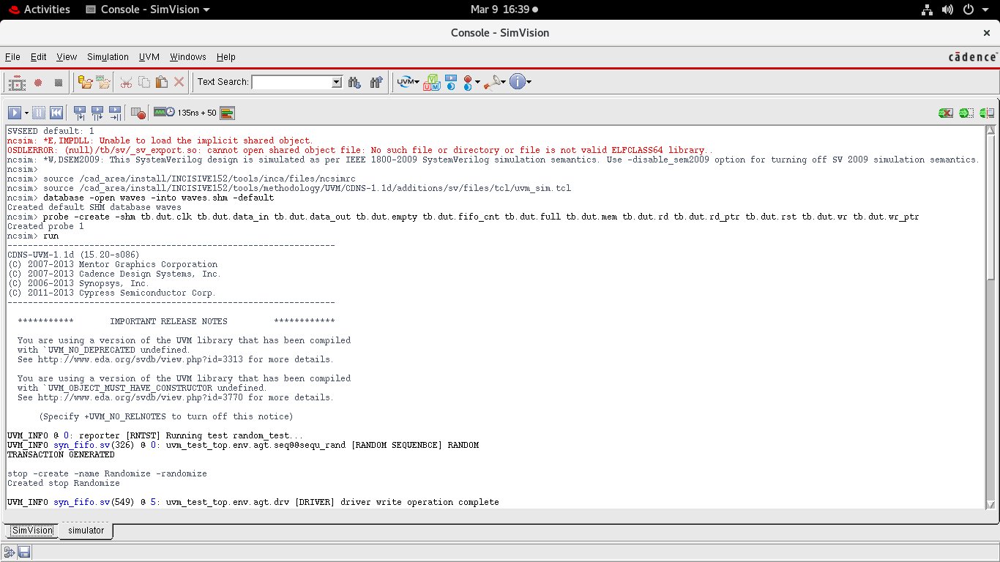
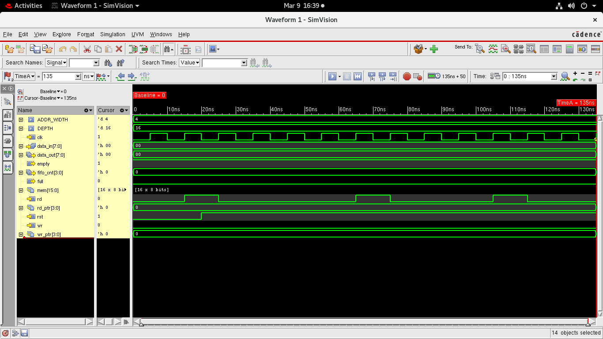
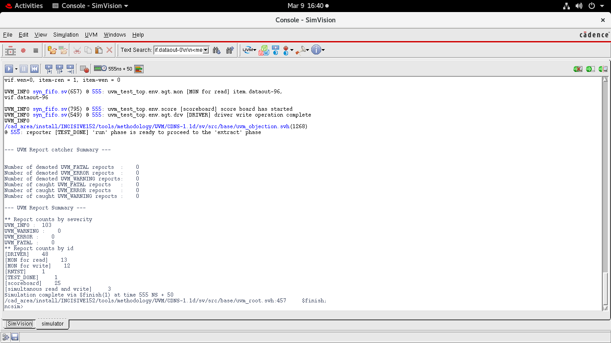

# 📘 Synchronous FIFO UVM Verification – Simulation Results

This document shows the **simulation results, waveforms, and coverage reports** for the **Synchronous FIFO Verification using UVM**.

The verification was performed using:

- SystemVerilog
- UVM (Universal Verification Methodology)
- Cadence Xcelium
- Cadence SimVision
- Cadence IMC for coverage analysis

---

# ✅ Stress Test Simulation

**Description:**  
This screenshot shows the **SimVision console output during the stress_test execution**.

Key points:
- The UVM environment starts the `stress_test`
- Driver, monitor, and scoreboard are active
- Multiple transactions are applied to the FIFO
- Simulation completes successfully with **no errors or fatal messages**

---

# 🔬 Stress Test Waveform

**Description:**  
This waveform shows FIFO behavior during the stress test.

Signals visible:
- `clk`
- `data_in`
- `data_out`
- `wr`
- `rd`
- `fifo_cnt`
- `wr_ptr`
- `rd_ptr`
- `full`
- `empty`

Observation:
- Write pointer increments during writes
- Read pointer increments during reads
- FIFO counter tracks the number of stored elements
- Data exits FIFO in **First-In-First-Out order**

---

# 📊 Verification Hierarchy (Coverage)

**Description:**  
This image shows the **Verification Hierarchy inside Cadence IMC**.

Hierarchy includes:
- UVM Package
- Testbench
- FIFO Interface
- Assertion module
- DUT instance

Coverage results are collected across all these components.

---

# 📊 Verification Metrics Summary

**Description:**  
This screenshot shows the **overall verification coverage summary**.

Metrics include:

- Code Coverage
- Expression Coverage
- Toggle Coverage
- Assertion Coverage

Overall coverage achieved is approximately **90%**, indicating that most RTL logic paths were exercised.

---

# 📊 Detailed Coverage Metrics

**Description:**  
This view shows **detailed coverage statistics**.

Coverage breakdown:

| Coverage Type | Result |
|---------------|-------|
| Block Coverage | 100% |
| Expression Coverage | ~83% |
| Toggle Coverage | ~92% |
| Assertion Coverage | ~87% |

This confirms that the verification environment exercises most functional scenarios.

---

# 🧪 Directed Test – Simulation Log

**Description:**  
This screenshot shows the **UVM report summary for the directed test**.

 

The scoreboard reports **no mismatches**, confirming correct FIFO functionality.

---

# 🔬 Directed Test Waveform

**Description:**  
This waveform shows **basic FIFO operation**.

Behavior observed:

- Sequential write operations fill the FIFO
- FIFO counter increases accordingly
- Read operations remove data
- FIFO counter decreases
- Data output matches the order of input data

---

# 🎲 Random Test – Simulation Log

**Description:**  
This screenshot shows the execution of the **random_test sequence**.

Features:

- Constrained random transactions
- Random read/write operations
- Random data inputs

This helps verify the FIFO under **non-deterministic traffic patterns**.

---

# 🔬 Random Test Waveform

**Description:**  
This waveform shows **random FIFO activity**.

Observations:

- Random bursts of writes and reads
- FIFO counter changes dynamically
- Data integrity is preserved
- No overflow or underflow errors occur

---

# 📊 Stress Test – Final Report

**Description:**  
This screenshot shows the **final simulation summary for the stress test**.

Results confirm:

- Multiple transactions executed
- Scoreboard verified correct behavior
- Simulation completed without errors

---

# ✅ Verification Summary

The FIFO verification environment successfully tested:

- Write operations
- Read operations
- FIFO full condition
- FIFO empty condition
- Random traffic
- Simultaneous read/write
- Stress testing

Coverage results show **~90% overall verification coverage**, indicating strong testbench effectiveness.

---

# 👨‍💻 Author

**Subhash Joshi**

Digital Design and Verification

GitHub  
https://github.com/Joshisubhash

LinkedIn  
https://linkedin.com/in/subhash-joshi-ab9144262
