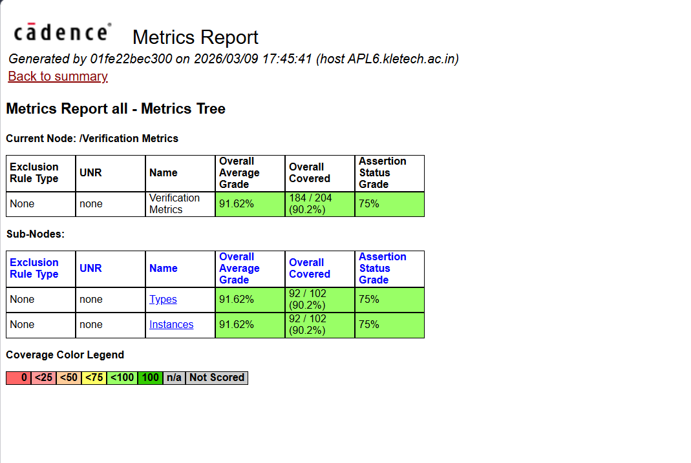
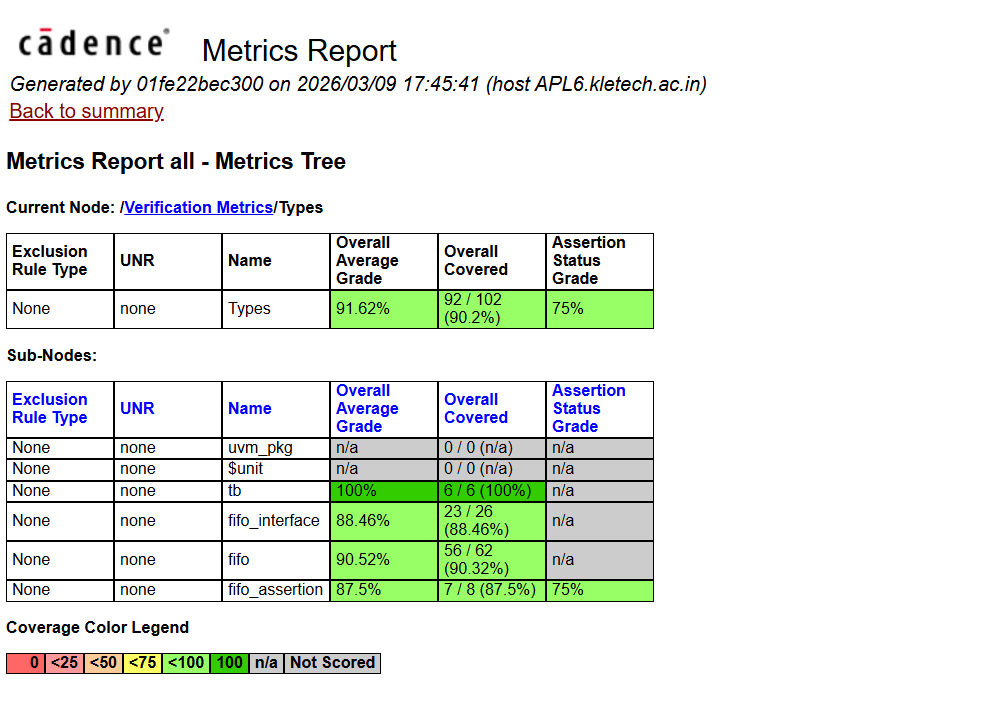
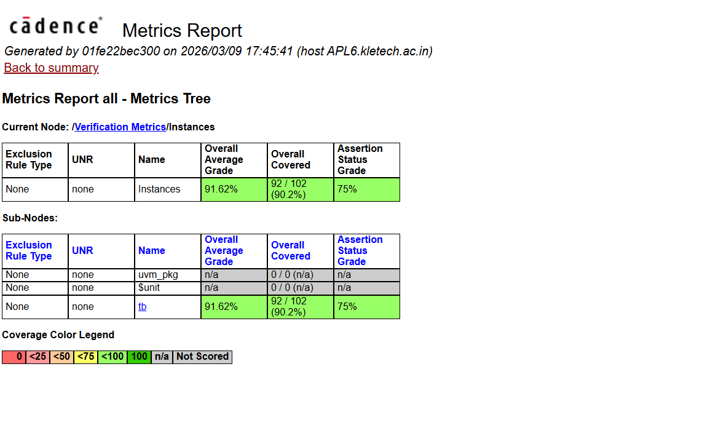
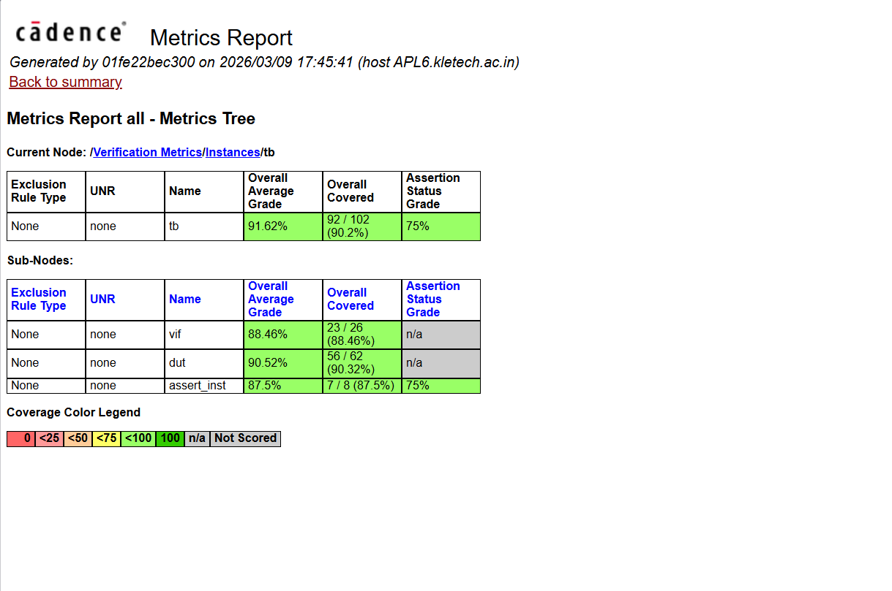
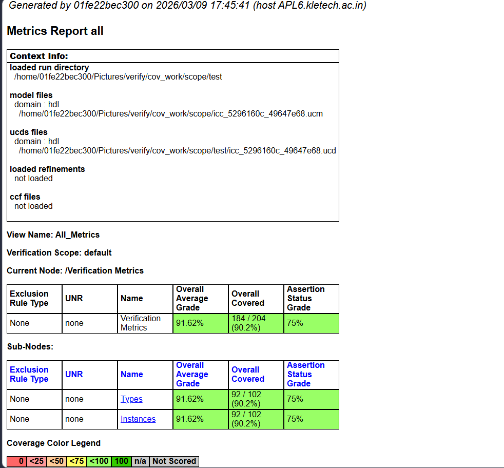

#  Coverage Report – Cadence IMC (FIFO UVM Verification)

This section presents the **coverage analysis results** of the Synchronous FIFO verification using **UVM + SystemVerilog Assertions (SVA)** on Cadence Xcelium.

 Full Interactive HTML Report:  
👉 [Open Coverage Report](https://Joshisubhash.github.io/synchronous_fifo_uvm_verification/reports/index.html)

---

##  1. Overall Coverage Summary

<!--

-->

**Description:**  
This is the **top-level coverage report** showing overall verification quality.

- Overall Coverage: **91.62%**
- Covered Points: **184 / 204 (90.2%)**
- Assertion Coverage: **75%**

✔ Indicates strong functional and code coverage across the design.

---

##  2. Coverage Hierarchy View

<!--

-->
🔗 HTML View: Live View: [Verification Metrics Tree](https://Joshisubhash.github.io/synchronous_fifo_uvm_verification/reports/node_1.html)

**Description:**  
Shows hierarchical breakdown into:
- **Types**
- **Instances**

 Helps understand how coverage is distributed structurally.

---

## 📊 3. Types-Based Coverage Breakdown
<!--

-->
🔗 HTML View: Live View: [Types Breakdown](https://Joshisubhash.github.io/synchronous_fifo_uvm_verification/reports/node_2.html)

**Description:**  
Coverage categorized by design components:

- Testbench (tb): **100%**
- FIFO Interface: **88.46%**
- FIFO DUT: **90.52%**
- Assertions: **87.5%**

✔ Confirms each module is independently verified.

---

##  4. Instance-Level Coverage
<!--

-->
🔗 HTML View: Live View: [Instances View](https://Joshisubhash.github.io/synchronous_fifo_uvm_verification/reports/node_9.html)

**Description:**  
Breakdown across instances:

- `uvm_pkg`, `$unit` → n/a (expected)
- `tb` → main contributor

✔ Shows active verification happens inside testbench.

---

##  5. Testbench Internal Coverage
<!--

-->
🔗 HTML View: [TB Internal View](https://Joshisubhash.github.io/synchronous_fifo_uvm_verification/reports/node_12.html)

**Description:**  
Detailed coverage inside testbench:

- Interface (vif): **88.46%**
- DUT: **90.52%**
- Assertions: **87.5% (75% graded)**

 Confirms correctness of DUT behavior using assertions.

---

#  Final Coverage Summary

| Metric                | Value        |
|----------------------|-------------|
| Overall Coverage     | **91.62%**  |
| Code Coverage        | **~90%**    |
| Assertion Coverage   | **~87.5%**  |
| Testbench Coverage   | **100%**    |

---

#  Key Highlights

- Built complete **UVM Verification Environment**
- Implemented **Constrained-Random Testing**
- Integrated **SystemVerilog Assertions (SVA)**
- Achieved **90%+ functional and code coverage**
- Verified FIFO across multiple scenarios:
  - Normal operation
  - Random stress testing
  - Corner cases (full/empty conditions)

# Author

**Subhash Joshi**  
Digital Design and Verification Engineer  

---

